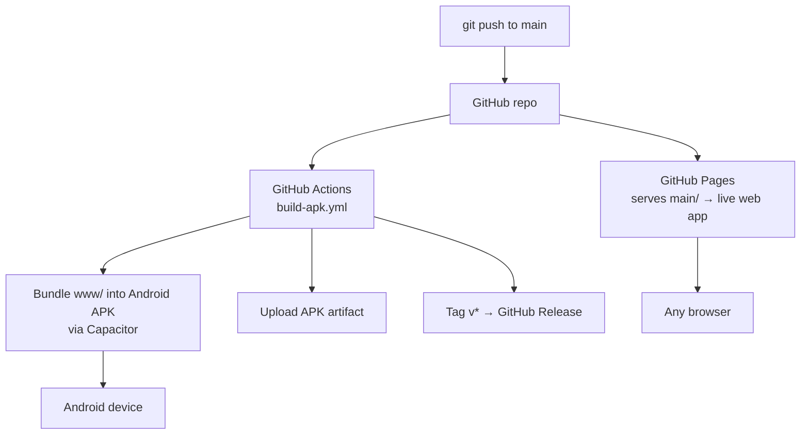
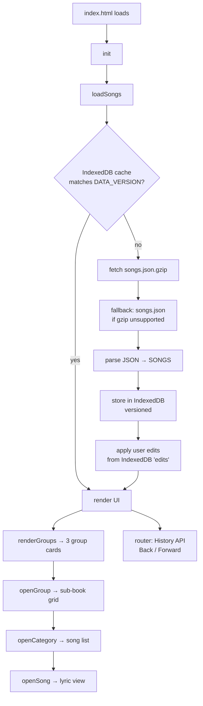
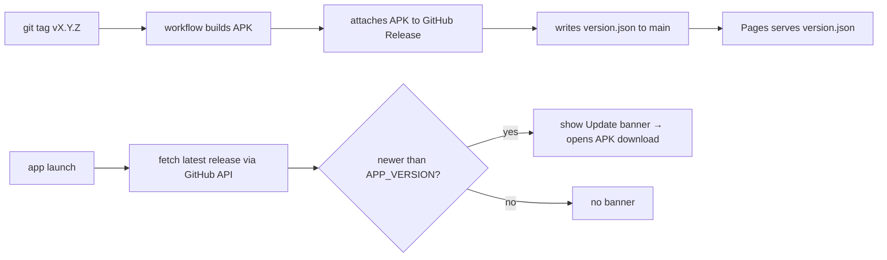

# Khristian Labu — How It Works

## Deployment pipeline

## Runtime (web & APK share the same index.html)

## Features (all client-side)

| Area | Where | Notes |
|------|-------|-------|
| Favourites / History | `localStorage` | per-device |
| Playlists (multiple) | `localStorage` | named lists |
| Search | in-memory filter | live as you type |
| Settings | `localStorage` | theme, wake-lock, reset |
| Manage Songs (admin) | IndexedDB `edits` | edit/add/export; survive data updates |

## Key design points

- **One codebase, two targets** — `www/` (index.html + songs.json + logo + assets) is served to the web *and* bundled into the Android APK via Capacitor. No separate mobile code.
- **Data loads at runtime** (`fetch`), not embedded — a `songs.json` change ships without touching app code. `DATA_VERSION` bumps invalidate the IndexedDB cache.
- **Offline edits** — user song edits are stored separately in IndexedDB (`edits`) and replayed over the base corpus on every load, so they survive `songs.json` updates.
- **Gzip speedup** — web/APK fetch `songs.json.gzip` (630KB) via `DecompressionStream`, falling back to plain `songs.json` (2.2MB).
- **Hybrid app** — the APK is a native Android shell running the web assets in a Chromium WebView: installs like a real app, works offline, but the UI is web tech (not Kotlin/native UI).
- **Centered, responsive UI** — homepage group cards centered on desktop/tablet; menu popup is a centered modal (two-column landscape layout on desktop, single column on mobile).

## App updates (free, self-hosted distribution)

The website (Pages) updates automatically on every push. The APK is distributed via **GitHub Releases** (built by the workflow on each `v*` tag) and delivered to users with a free in-app update prompt — no Play Store, no backend.

- **Detection**: on launch (and every 6h) the app calls the CORS-enabled GitHub Releases API (`releases/latest`), compares `tag_name` to the embedded `APP_VERSION`, and shows a dismissible banner if newer.
- **Update action**: the banner's "Update" button opens the release APK `browser_download_url`; Android then prompts to install (no auto-install, by design).
- **Version wiring**: the `APP_VERSION` constant in `index.html` is rewritten to the tag at build time, and `version.json` is committed to `main` so Pages serves it. Dismissal is remembered per version in `localStorage`.
- **Free tier**: GitHub Releases + API are free; the unauthenticated API limit (60 req/hr per IP) is ample for occasional client checks.

