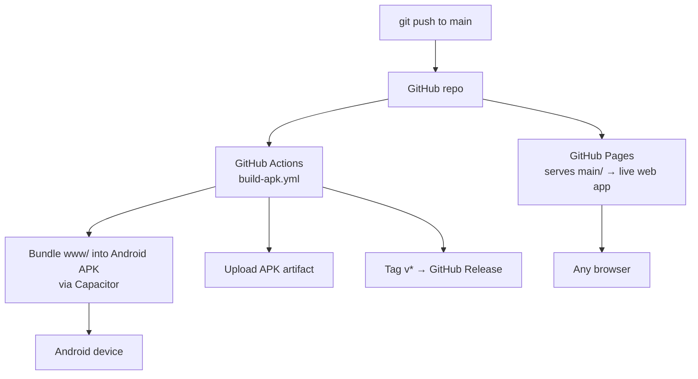
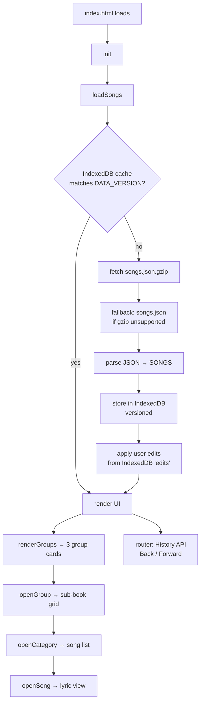
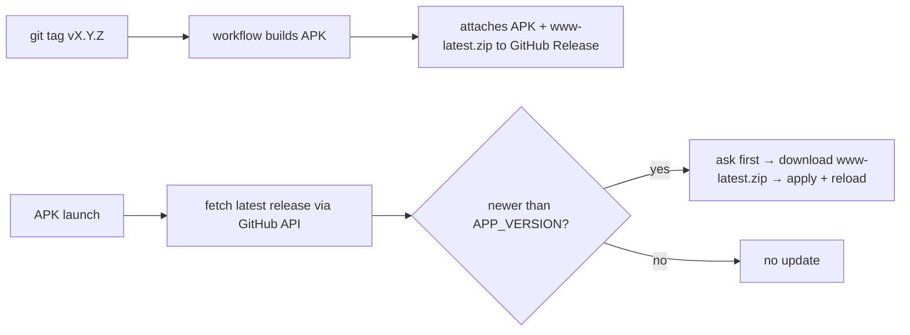

# Khristian Labu — How It Works

## Deployment pipeline

```mermaid
flowchart TD
    A[git push to main] --> B[GitHub repo]
    B --> C[GitHub Pages<br/>serves main/ → live web app]
    B --> D[GitHub Actions<br/>build-apk.yml]
    D --> E[Bundle www/ into Android APK<br/>via Capacitor]
    D --> F[Upload APK artifact]
    D --> G[Tag v* → GitHub Release]
    E --> H[Android device]
    C --> I[Any browser]
```

## Runtime (web & APK share the same index.html)

```mermaid
flowchart TD
    START[index.html loads] --> INIT[init]
    INIT --> LOAD[loadSongs]
    LOAD --> CACHE{IndexedDB cache<br/>matches DATA_VERSION?}
    CACHE -- yes --> RENDER
    CACHE -- no --> FETCH[fetch songs.json.gzip]
    FETCH --> FALLBACK[fallback: songs.json<br/>if gzip unsupported]
    FALLBACK --> PARSE[parse JSON → SONGS]
    PARSE --> STORE[store in IndexedDB<br/>versioned]
    STORE --> EDITS[apply user edits<br/>from IndexedDB 'edits']
    EDITS --> RENDER[render UI]
    RENDER --> GRID[renderGroups → 3 group cards]
    GRID --> GROUP[openGroup → sub-book grid]
    GROUP --> CAT[openCategory → song list]
    CAT --> SONG[openSong → lyric view]
    RENDER --> ROUTER[router: History API<br/>Back / Forward]
```

## Features (all client-side)

| Area | Where | Notes |
|------|-------|-------|
| Favourites / History | `localStorage` | per-device |
| Playlists (multiple) | `localStorage` | named lists |
| Search | in-memory filter | live as you type |
| Settings | `localStorage` | theme, wake-lock, reset |
| Manage Songs (admin) | IndexedDB `edits` | edit/add/export; survive data updates |

## Key design points

- **One codebase, two targets** — `www/` (index.html + songs.json + logo + assets) is served to the web *and* bundled into the Android APK via Capacitor. No separate mobile code.
- **Data loads at runtime** (`fetch`), not embedded — a `songs.json` change ships without touching app code. `DATA_VERSION` bumps invalidate the IndexedDB cache.
- **Offline edits** — user song edits are stored separately in IndexedDB (`edits`) and replayed over the base corpus on every load, so they survive `songs.json` updates.
- **Gzip speedup** — web/APK fetch `songs.json.gzip` (630KB) via `DecompressionStream`, falling back to plain `songs.json` (2.2MB).
- **Hybrid app** — the APK is a native Android shell running the web assets in a Chromium WebView: installs like a real app, works offline, but the UI is web tech (not Kotlin/native UI).
- **Centered, responsive UI** — homepage group cards centered on desktop/tablet; menu popup is a centered modal (two-column landscape layout on desktop, single column on mobile).
- **Status bar (APK)** — the `@capacitor/status-bar` plugin keeps the app below the Android status bar (`setOverlaysWebView(false)`), colors it to match the theme, and picks light/dark icons. On Android 15+ (forced edge-to-edge) the nav is padded below the bar via a three-layer fallback: `max(env(safe-area-inset-top), var(--safe-area-inset-top), var(--sat-fallback))` — the last being the plugin's native `getInfo().height`, applied only when the WebView reports no inset at all.
- **Reader bar** — the font/line-spacing controls are always visible. The bar lives in an in-flow `position:sticky;bottom:0` host **after** the lyrics in the DOM (not `position:fixed`): on a scrollable song it sticks to the viewport bottom (always visible at the lowest position, above the gesture bar via `--sab`, synced from Capacitor's `--safe-area-inset-bottom`), and on a one-screen song it rests right after the last line — no dead zone, and lyrics can never scroll under it because the bar is a sibling that follows them (its real rendered height, even under system font scaling, is naturally accounted for in the document flow). When a song's lyrics fit on one screen the page scroll is **locked** (nothing to scroll); increasing the font size or line spacing past the fold unlocks scrolling again.

## App updates (free, self-hosted distribution)

The website (Pages) updates automatically on every push. The APK is distributed via **GitHub Releases** (built by the workflow on each `v*` tag) and updates itself **in-app via over-the-air (OTA) bundles** — users never reinstall the APK or visit the release page. No Play Store, no backend, no paid cloud.

```mermaid
flowchart LR
    A[git tag vX.Y.Z] --> B[workflow builds APK]
    B --> C[attaches APK + www-latest.zip to GitHub Release]
    F[APK launch] --> G[fetch latest release via GitHub API]
    G --> H{newer than APP_VERSION?}
    H -- yes --> I[ask first → download www-latest.zip → apply + reload]
    H -- no --> J[no update]
```

- **Web users**: the Pages build updates automatically on every push (no action needed).
- **APK users**: `@capgo/capacitor-updater` runs in **manual mode** (`autoUpdate: false`, no cloud). On launch (max once/day) and via Settings → "Check for update", the app calls the CORS-enabled GitHub Releases API, compares `tag_name` to the embedded `APP_VERSION`, and if newer asks "Update now?" — then downloads the release's `www-latest.zip` bundle (showing a **live progress card** from the plugin's `download` events) and applies it in place. `notifyAppReady()` is called **at boot, before the heavy corpus load** — the plugin auto-rolls back if it isn't called within `appReadyTimeout` (10s default, 30s pending; config set to 120s), and waiting for the full 5,719-song load used to race that window and revert every update on slow devices. A bundle that fails to boot (JS error, blank screen) still rolls back because the script never runs. If OTA can't install (e.g. an APK built before signing, no public key), the app falls back to showing the APK download banner.
- **Bundle packaging + signing**: the workflow zips `www/` into `www-latest.zip` and — when the `OTA_SIGNING_PRIVATE_KEY` secret is set — **code-signs** it via `@capgo/cli bundle encrypt` (AES-encrypts the zip, RSA-signs the checksum + per-bundle session key). The APK ships the matching **public key** (`capacitor.config.json` → `CapacitorUpdater.publicKey`), and the plugin verifies the signature before installing — a tampered or forged bundle is rejected. The per-bundle `sessionKey`/`checksum` ride in the release's `ota-session.json` asset (safe to publish: they're RSA-encrypted and only verifiable with the private key). Without the secret set, the bundle is attached unsigned and installs with no verification (legacy behavior). Keypair: RSA-2048, private key must be **PKCS#1** (`BEGIN RSA PRIVATE KEY`) for the CLI; public key is the matching PKCS#1 `RSA PUBLIC KEY` form.
- **Native caveat**: OTA updates the web bundle only — if a future release adds a new Capacitor *native* plugin, users must install that APK once; pure content/JS changes (the vast majority) never require it.
- **Web banner**: the dismissible "Update available → download APK" banner remains for web visitors who want the Android app.
- **Free tier**: GitHub Releases + API are free; the unauthenticated API limit (60 req/hr per IP) is ample for occasional client checks.

## PWA / offline support

The website is installable and works offline (no backend, all static on Pages).

- **`manifest.webmanifest`** — name, icons (192/512 from `assets/logo.svg`), `display: standalone`, `theme-color`. Enables "Add to Home Screen".
- **`sw.js`** — a service worker caching strategy:
  - App **shell** (index.html, logo, manifest, icons): precached on install; **network-first** with cache fallback, so the UI is always fresh when online and still loads offline.
  - **Song data** (`songs.json` / `songs.json.gzip`): **cache-first** with background refresh → instant repeat loads and full offline access after the first visit.
  - Cache name is `labu-vN` tied to `DATA_VERSION`; bump both together so data updates propagate.
  - Only registers on the **web** (`!window.Capacitor`); the native APK already ships assets offline, so the SW is skipped there.
- **Meta**: `theme-color`, `apple-mobile-web-app-*` tags added to `<head>`.

