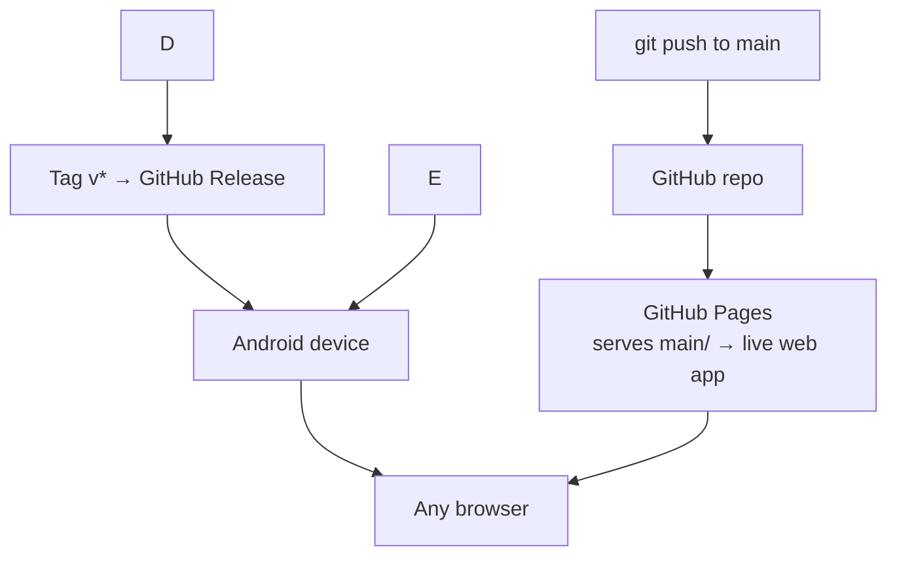
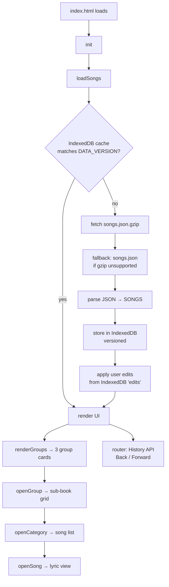
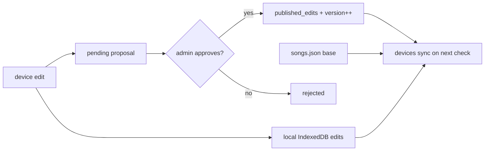
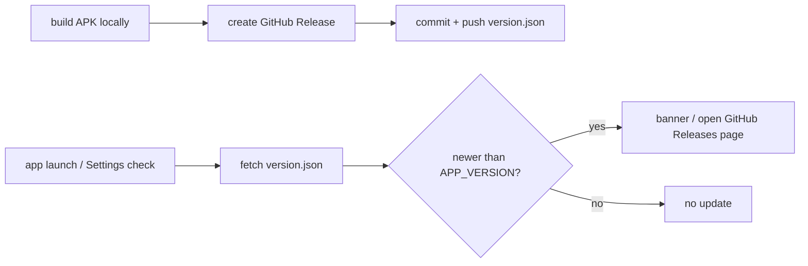

# Khristian Labu — How It Works

## Deployment pipeline

```mermaid
flowchart TD
    A[git push to main] --> B[GitHub repo]
    B --> C[GitHub Pages<br/>serves main/ → live web app]
    G[local Gradle build] --> H[Bundle www/ into Android APK<br/>via Capacitor]
    H --> I[Upload APK to GitHub Release]
    D --> G[Tag v* → GitHub Release]
    E --> H[Android device]
    C --> I[Any browser]
```

## Runtime (web & APK share the same index.html)

```mermaid
flowchart TD
    START[index.html loads] --> INIT[init]
    INIT --> LOAD[loadSongs]
    LOAD --> CACHE{IndexedDB cache<br/>matches DATA_VERSION?}
    CACHE -- yes --> RENDER
    CACHE -- no --> FETCH[fetch songs.json.gzip]
    FETCH --> FALLBACK[fallback: songs.json<br/>if gzip unsupported]
    FALLBACK --> PARSE[parse JSON → SONGS]
    PARSE --> STORE[store in IndexedDB<br/>versioned]
    STORE --> EDITS[apply user edits<br/>from IndexedDB 'edits']
    EDITS --> RENDER[render UI]
    RENDER --> GRID[renderGroups → 3 group cards]
    GRID --> GROUP[openGroup → sub-book grid]
    GROUP --> CAT[openCategory → song list]
    CAT --> SONG[openSong → lyric view]
    RENDER --> ROUTER[router: History API<br/>Back / Forward]
```

## Features (all client-side)

| Area | Where | Notes |
|------|-------|-------|
| Favourites / History | `localStorage` | per-device |
| Playlists (multiple) | `localStorage` | named lists |
| Search | in-memory filter | live as you type |
| Settings | `localStorage` | theme, wake-lock, reset |
| Manage Songs (admin) | IndexedDB `edits` | edit/add/export; survive data updates |

## Key design points

- **One codebase, two targets** — `www/` (index.html + songs.json + logo + assets) is served to the web *and* bundled into the Android APK via Capacitor. No separate mobile code.
- **Data loads at runtime** (`fetch`), not embedded — a `songs.json` change ships without touching app code. `DATA_VERSION` bumps invalidate the IndexedDB cache.
- **Offline edits** — user song edits are stored separately in IndexedDB (`edits`) and replayed over the base corpus on every load, so they survive `songs.json` updates.
- **Approved-change sync (Supabase)** — submitted edits become pending proposals; an admin approval appends to `published_edits` and bumps `publish_state.version`. Devices replay base corpus → approved overlay → own edits, so an approval reaches web and APK installs without a rebuild. See `supabase/README.md`.
- **Gzip speedup** — web/APK fetch `songs.json.gzip` (630KB) via `DecompressionStream`, falling back to plain `songs.json` (2.2MB).
- **Hybrid app** — the APK is a native Android shell running the web assets in a Chromium WebView: installs like a real app, works offline, but the UI is web tech (not Kotlin/native UI).
- **Centered, responsive UI** — homepage group cards centered on desktop/tablet; menu popup is a centered modal (two-column landscape layout on desktop, single column on mobile).
- **Status bar (APK)** — the `@capacitor/status-bar` plugin keeps the app below the Android status bar (`setOverlaysWebView(false)`), colors it to match the theme, and picks light/dark icons. On Android 15+ (forced edge-to-edge) the nav is padded below the bar via a three-layer fallback: `max(env(safe-area-inset-top), var(--safe-area-inset-top), var(--sat-fallback))` — the last being the plugin's native `getInfo().height`, applied only when the WebView reports no inset at all.
- **List DOM persistence** — song-list rows are cached per list (keyed by category/fav/recent/playlist id) as both HTML and live detached nodes. Back/forward nav returns to a list whose rows are already rendered and just re-shows the view (or re-attaches cached nodes) — zero DOM rebuild, no re-fade. Edits and fav-toggles invalidate the caches so lists re-render fresh when data actually changed.
- **Reader footer** — the font/line-spacing controls AND the song actions (edit / playlist / favorite / share, moved here from above the title) live in a dedicated footer element. `#detailView` is a flex column: the lyrics scroll inside `#songScroll` (a `flex:0 1 auto; overflow-y:auto` container), and `#readerControlsHost` is a separate in-flow sibling **below** it. Because the scroll container clips at the footer's top edge, lyrics can physically never render, scroll, or disappear behind the footer — at any scroll position, with any footer height (system font scaling, safe-area insets), on any device. Long songs fill the space above the footer and scroll; short songs end naturally right above it (no dead zone) with the container scroll-locked until the font size or line spacing grows past the fold. Bottom safe-area (`--sab`) is synced from Capacitor's `--safe-area-inset-bottom`, and the footer's real height (`--footer-h`) keeps the WhatsApp share FAB/menu floating above it.

## Approved-change sync (Supabase)

Editing stays offline-first: a change applies on the device immediately and is
queued as a proposal. The admin reviews the queue in Manage Songs and approves;
approval writes the change into `published_edits` and increments
`publish_state.version` in one transaction. Every device compares that version on
launch, on focus, on `online`, and every 5 minutes, then rebuilds the corpus in
place from the IndexedDB base copy.

```mermaid
flowchart LR
    E[device edit] --> L[local IndexedDB edits]
    E --> P[pending proposal]
    P --> R{admin approves?}
    R -- yes --> O[published_edits + version++]
    R -- no --> X[rejected]
    O --> S[devices sync on next check]
    B[songs.json base] --> S
    L --> S
```

Only the diff layer lives in Supabase, so the corpus is never re-uploaded and
`DATA_VERSION` does not change when something is approved. The config is two
public values (project URL + anon key); with them blank the app is purely local.

## App updates (free, self-hosted distribution)

The website (Pages) updates automatically on every push. The APK is compiled locally and distributed via **GitHub Releases**; no GitHub Actions workflow builds or publishes it. Update checks are **detection only** — the app points the user at the release page and they download and install the new APK manually. No Play Store, no backend, no paid cloud.

```mermaid
flowchart LR
    A[build APK locally] --> B[create GitHub Release]
    B --> C[commit + push version.json]
    F[app launch / Settings check] --> G[fetch version.json]
    G --> H{newer than APP_VERSION?}
    H -- yes --> I[banner / open GitHub Releases page]
    H -- no --> J[no update]
```

- **Web users**: the Pages build updates automatically on every push (no action needed).
- **APK users**: `fetchUpdateInfo()` compares the newest release against the embedded `APP_VERSION`. The primary source is the **static `version.json`** (committed in the repo, served by `raw.githubusercontent.com` + GitHub Pages — no rate limit, no auth, CORS-open); the GitHub Releases API is only a fallback because its 60 req/hr/IP cap silently killed the check on phones sharing mobile NAT IPs. The check runs once at start-up and on demand from Settings → **Check for update**; when a newer version exists, the app shows a centered, persistent update card (until the user taps **Update now** or dismisses it) and the Settings action also opens the download. Both point at the release **asset** (`releases/latest/download/khristian-labu.apk`), so the system browser downloads the APK and Android offers to install it. There is no custom in-app installer.
- **Free tier**: GitHub Releases + API are free; the unauthenticated API limit (60 req/hr per IP) is ample for occasional client checks.

## PWA / offline support

The website is installable and works offline (no backend, all static on Pages).

- **`manifest.webmanifest`** — name, icons (192/512 from `assets/logo.svg`), `display: standalone`, `theme-color`. Enables "Add to Home Screen".
- **`sw.js`** — a service worker caching strategy:
  - App **shell** (index.html, logo, manifest, icons): precached on install; **network-first** with cache fallback, so the UI is always fresh when online and still loads offline.
  - **Song data** (`songs.json` / `songs.json.gzip`): **cache-first** with background refresh → instant repeat loads and full offline access after the first visit.
  - Cache name is `labu-vN` tied to `DATA_VERSION`; bump both together so data updates propagate.
  - Only registers on the **web** (`!window.Capacitor`); the native APK already ships assets offline, so the SW is skipped there.
- **Meta**: `theme-color`, `apple-mobile-web-app-*` tags added to `<head>`.

