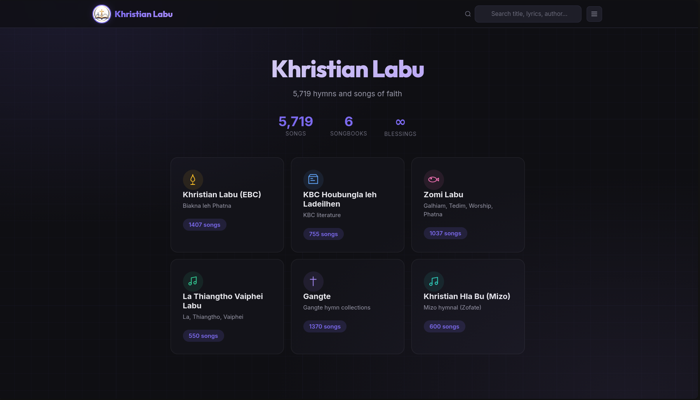
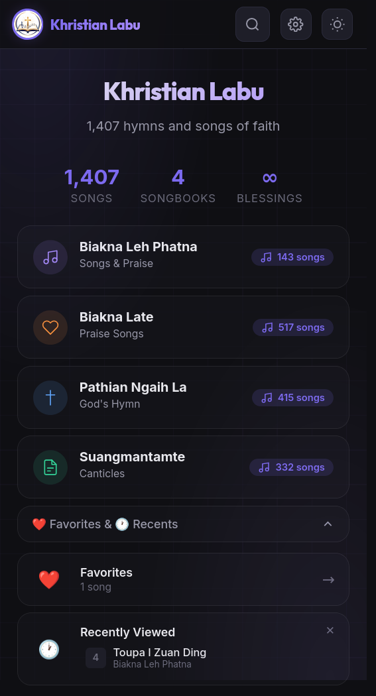

# Khristian Labu

A gospel songbook app — 1,407 hymns across 4 songbooks.

Try it live: [minatolun-dotcom.github.io/khristian-labu](https://minatolun-dotcom.github.io/khristian-labu/)

## Screenshots

**Desktop**


**Mobile**


## Features

- Browse 4 songbooks: Biakna Leh Phatna, Biakna Late, Pathian Ngaih La, Suangmantamte
- Full-text search across titles, authors, and verses
- Favorites & recently viewed (saved locally)
- Dark/light theme
- Admin panel for adding, editing, deleting songs
- Find & replace across all songs
- Export songs as JSON or plain text

## Download

Grab the latest APK from the [Releases](https://github.com/minatolun-dotcom/khristian-labu/releases) page.

## Development

All source is in a single file — `index.html`. No build tools needed.

```bash
# edit index.html, then push to trigger a new APK build
git add -A
git commit -m "your changes"
git push
```

The GitHub Action builds a fresh APK on every push to `main`. To create a release:

```bash
git tag v1.0.1
git push --tags
```

## License

MIT
