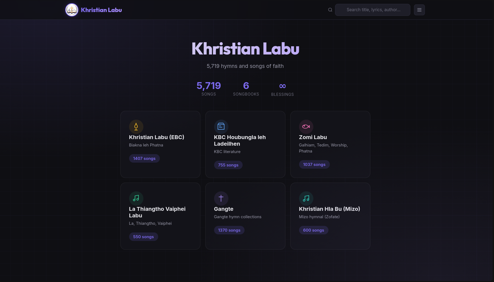
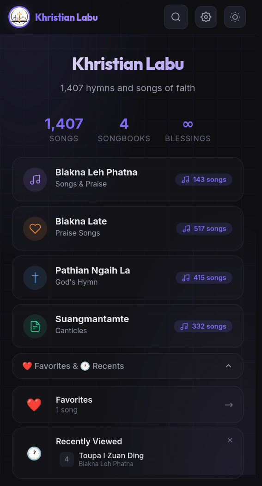

# Khristian Labu

A gospel songbook app — 5,719 hymns across 17 songbooks in 6 collections.

Try it live: [minatolun-dotcom.github.io/khristian-labu](https://minatolun-dotcom.github.io/khristian-labu/)

## Screenshots

**Desktop**


**Mobile**


## Features

- **17 songbooks across 6 collections** (Kuki, Zomi, Mizo): Khristian Labu (EBC), KBC, Zomi Labu, Tedim, La Thiangtho Vaiphei, Gangte, Mizo Khristian Labu, and more
- **Full-text search** — titles, authors, verses, and numbers, with filters, sorts, and recent-search history; search scopes to the open songbook, collection, playlist, favorites, or history list
- **Favorites & recently viewed** (saved locally)
- **Playlists** — create, rename, delete; export as JSON or plain text
- **Reader** — adjustable font size & line spacing, per-song scroll memory, verse jump, swipe between songs
- **WhatsApp share** — share any lyric as text or as a full-song screenshot (even if it scrolls)
- **Google Drive backup & restore** (optional sign-in) plus local backup/restore of settings, favorites, recents, playlists, and edits
- **Works offline** — full corpus cached via service worker + IndexedDB
- **In-app updates** — the APK self-updates over-the-air (signed bundles from GitHub Releases), no reinstall
- Dark/light theme, admin panel for adding/editing/deleting songs, find & replace across all songs

## Download

Grab the latest APK from the [Releases](https://github.com/minatolun-dotcom/khristian-labu/releases) page.
Once installed, the app updates itself in-app — no need to visit the Releases page again.

## Development

All app source lives in a single file — `index.html` (plus `sw.js` for offline caching). No web build step.

```bash
# serve locally
python -m http.server 8000
# open http://localhost:8000
```

### Releasing a new version

The CI workflow (`build-apk.yml`) builds the web app, the signed APK, and the OTA bundle on **version tags only** — plain pushes to `main` just update the web app (GitHub Pages).

```bash
# 1. bump the version (keep these in sync)
#    - const APP_VERSION in index.html
#    - version.json

# 2. tag + push
git tag v1.4.0
git push origin main --tags
```

The workflow then publishes a GitHub Release containing `khristian-labu.apk`, the signed `www-latest.zip` OTA bundle, and `ota-session.json`. APK users get the update in-app.

### Tests

```bash
npm test            # data/corpus validation + full browser E2E suite (68+ checks)
```

- `scripts/validate_data.py` — corpus integrity (IDs, verses, groups↔counts, gzip match, no HTML in lyrics)
- `scripts/e2e_full.mjs` — drives the real UI in headless Chromium (needs `npx playwright install chromium` once)

## License

MIT
