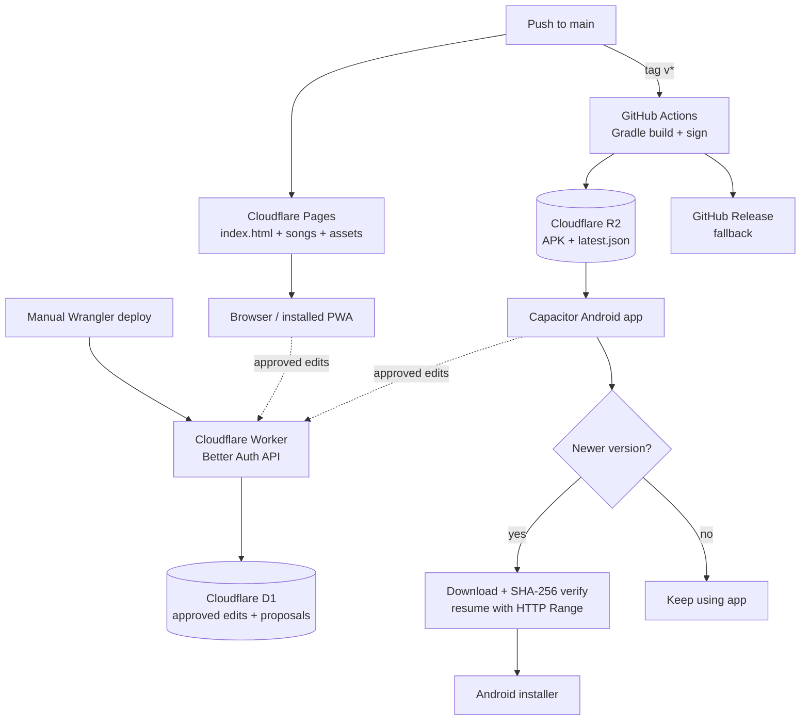

# Khristian Labu

A gospel songbook app — 5,723 hymns across 17 songbooks in 6 collections.

[Try it live](https://labu.lengkhawm.online/) · [Download the APK](https://github.com/minatolun-dotcom/khristian-labu/releases)

## Tech stack

| Layer | Technology |
|---|---|
| **Web app** | Hand-written HTML, CSS, and JavaScript in `index.html`; no frontend framework or web build step |
| **Offline / PWA** | Service worker (`sw.js`), Web App Manifest, IndexedDB, and `localStorage` |
| **Android** | Capacitor 8 shell, Java Activity/updater bridge, Android SDK 36, minSdk 24 |
| **API** | Cloudflare Workers with Better Auth (plain `fetch` router) |
| **Database** | Cloudflare D1 (SQLite) for the approved-edit overlay, proposal queue, and auth tables |
| **Hosting** | Cloudflare Pages for the web app; Cloudflare R2 for APKs and `latest.json` |
| **Releases** | GitHub Actions + Gradle signing, GitHub Releases as fallback |
| **Testing** | Playwright end-to-end tests, Python corpus validation, and Node regression scripts |
| **Song tools** | html2canvas image sharing, Web Audio playback, Google Identity and Drive backup |

## How it works

One `index.html` is served to browsers and bundled into the Android APK. Editors stay
offline-first: local changes apply immediately, then sync as proposals through the
Worker. Approved changes live in D1 as a small overlay, so every device picks them up
without downloading a new corpus or APK.


```mermaid
flowchart TD
    PUSH[Push to main] --> PAGES[Cloudflare Pages<br/>index.html + songs + assets]
    DEPLOY[Manual Wrangler deploy] --> WORKER[Cloudflare Worker<br/>Better Auth API]
    WORKER --> D1[(Cloudflare D1<br/>approved edits + proposals)]
    PUSH -->|tag v*| CI[GitHub Actions<br/>Gradle build + sign]
    CI --> R2[(Cloudflare R2<br/>APK + latest.json)]
    CI --> GH[GitHub Release<br/>fallback]

    PAGES --> WEB[Browser / installed PWA]
    R2 --> APK[Capacitor Android app]
    WEB -. approved edits .-> WORKER
    APK -. approved edits .-> WORKER

    APK --> UPD{Newer version?}
    UPD -->|yes| DOWNLOAD[Download + SHA-256 verify<br/>resume with HTTP Range]
    DOWNLOAD --> INSTALL[Android installer]
    UPD -->|no| READY[Keep using app]
```

The Worker is deployed separately with `npm run api:deploy`; Pages and the Android
release are driven by GitHub Actions. For the deeper runtime, sync, reader, and
update details, see [`ARCHITECTURE.md`](ARCHITECTURE.md).

## Screenshots

**Web**


**Android**


## Features

- 17 songbooks across 6 Kuki, Zomi, and Mizo collections
- Full-text search of titles, lyrics, authors, and numbers across every songbook, with filters, sorting, and recent searches
- Choose which main songbooks appear on Home and in search; turn off collections you don't use
- Favorites and recently viewed songs, saved on device
- Playlists with rename, delete, and JSON or text export
- Reader with font size, line spacing, scroll memory, verse jump, and swipe navigation
- WhatsApp sharing as text or a full-song image
- Google Drive backup and restore, plus local backup
- Offline access to the entire songbook
- Dark and light themes, plus an admin editor with find and replace

## Install

Download the latest APK from [Releases](https://github.com/minatolun-dotcom/khristian-labu/releases)
([R2 release metadata](https://dl.labu.lengkhawm.online/latest.json)). The Android app checks `version.json` and `latest.json` on launch and from Settings → Check for update.
When a newer build exists it downloads in a centered progress card, verifies the published size and
SHA-256, then opens Android's installer. Tap outside the card to minimize it to a floating download
pill; an interrupted download resumes on the next attempt. If Android blocks installs from the app,
the card offers **Open settings**. The website does not show an update check because Pages always
serves the current build; browser visitors can still use the release links.

If Android reports a signature mismatch when installing a signed release over an older build,
export a local backup first, then uninstall the old app and install the release. That is a one-time
migration from the debug-signed builds; later signed releases install over each other normally.

## Development

The app is `index.html`, `app.js`, `styles.css`, and `sw.js` — there is no web build step. The approved-change
API lives in `workers/api` on Cloudflare Worker + D1 (see `workers/api/README.md`).

```bash
python3 scripts/serve_dev.py 8080   # http://localhost:8080
```

Build the Android APK:

```bash
npm run sync
cd android && ./gradlew assembleDebug --no-daemon
# android/app/build/outputs/apk/debug/app-debug.apk
```

The Android native project is tracked. Generated build outputs and copied web assets are ignored.
The padded launch-screen icons remain in `resources/android-splash/` and are installed by `npm run sync`.

Release builds are produced by `.github/workflows/android-release.yml` on a `v*` tag or manual dispatch. The workflow signs with the repository's `KEYSTORE_*` secrets, publishes the APK to `https://dl.labu.lengkhawm.online/apk/<versionCode>/khristian-labu.apk`, and creates the GitHub Release fallback.

To release, bump `APP_VERSION` in `app.js`, `version.json`, `CACHE` in `sw.js`, and `versionCode`/`versionName` in `android/app/build.gradle`, then:

```bash
git tag vX.Y.Z && git push origin main --tags
```

## Tests

```bash
npm test        # corpus validation + full browser E2E
npm run test:cloud   # approved-change client against a mocked Worker
npm run test:api     # 25-check contract suite (local or LABU_API_URL)
```

## License

MIT
